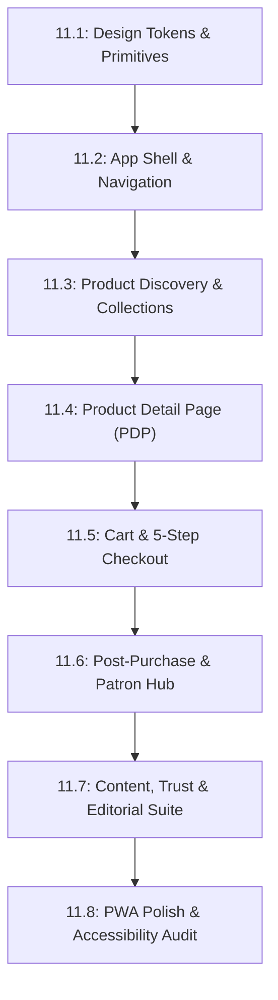

# Master Frontend Re-Architecture Sprint Plan (Sprint 11)

**Monorepo:** `devnadeemashraf/handh`  
**Target:** Complete Storefront PWA Re-Architecture to Luxury Design Specification  
**Architecture Spec:** [`docs/FRONTEND_ARCHITECTURE_AND_SYSTEM_DESIGN.md`](file:///home/nadeemashraf/Projects/H&H/docs/FRONTEND_ARCHITECTURE_AND_SYSTEM_DESIGN.md)  
**Design Reference:** [`docs/frontend-design-spec/`](file:///home/nadeemashraf/Projects/H&H/docs/frontend-design-spec)

---

## Sprint Overview & Roadmap

This sprint plan breaks down the entire frontend transformation into **8 bite-sized, atomic work packages (Sub-sprints 11.1 – 11.8)**. Each sub-sprint delivers fully tested, type-safe, formatted code with its own semantic git commit and quality gates verification (`format:check`, `lint`, `typecheck`, `test`, `build`).

---

## Sprint 11.1: Design Tokens, Typography & Core Primitives

**Design Specs:** `01_BRAND_AND_VISUAL_IDENTITY.md`, `02_DESIGN_TOKENS.md`, `03_COMPONENT_LIBRARY.md`, `13_MOTION_AND_MICROINTERACTIONS.md`  
**Goal:** Establish the foundational token system, typography (`Fraunces` + `Inter`), CSS custom properties, and rebuild the headless UI primitives with strict `radius-md: 4px` limits.

### Work Breakdown

1. **Typography & Font Injection:**
   - Configure Next.js font loaders for `Fraunces` (variable serif for display headlines) and `Inter` (sans-serif for body, UI, and tabular numbers) in `apps/web/src/app/layout.tsx`.
   - Update CSS font variables `--font-serif` and `--font-sans`.
2. **Tailwind Config & CSS Variables:**
   - Update `apps/web/tailwind.config.ts` and `apps/web/src/app/globals.css` with the exact token palette:
     - Neutral palette: `--color-bg-canvas` (`#FAF7F2`), `--color-bg-surface` (`#FFFFFF`), `--color-bg-sunken` (`#F1ECE3`), `--color-text-primary` (`#1F1B18`), `--color-text-secondary` (`#6B6459`), `--color-text-tertiary` (`#9C9483`), `--color-border-subtle` (`#E7E0D4`), `--color-border-strong` (`#D2C8B6`).
     - Accent Royal palette: `--color-accent-royal` (`#2E3454`), `--color-accent-royal-hover` (`#252A45`), `--color-accent-royal-tint` (`#E7E9F0`).
     - Semantic colors: `--color-success` (`#5B6E4F`), `--color-error` (`#9C4A3B`), `--color-warning` (`#8A6D3B`), `--color-sale` (`#7A2E2E`).
     - Radius tokens: `radius-sm` (2px), `radius-md` (4px), `radius-full` (999px). Enforce no radius > 4px!
     - Elevation tokens: `elevation-0` (hairline border), `elevation-1` (sticky bars), `elevation-2` (modals/sheets).
     - Motion durations: `100ms`, `180ms`, `240ms`, `400ms`.
3. **Core UI Primitives (`apps/web/src/components/ui/`):**
   - **Button (`button.tsx`)**: `primary` (Royal blue), `secondary` (1px outline), `ghost`, `destructive`; sizes `lg` (48px), `md` (44px), `sm` (36px with 44px hit-target); active scale 98%; loading spinner.
   - **Input (`input.tsx`)**: 44px height, `radius-sm`, reserved space for helper/error text to prevent CLS.
   - **Badge (`badge.tsx`)**: `type-label` (uppercase, +0.06em tracking), `radius-sm`, filled tints for New, Sale, Low Stock, Sold Out.
   - **Alert (`alert.tsx`)**: Full-width within container, `radius-md`, semantic tints, dismissible / non-dismissible.
   - **Toast (`toast.tsx`)**: Bottom-anchored on mobile, bottom-left on desktop, `elevation-2`, max 2 stacked toasts.
   - **Skeleton (`skeleton.tsx`)**: Shimmer sweep animation over sunken background, matching exact component geometries.
   - **Accordion (`accordion.tsx`)**: 48px header, chevron 180° rotation, measured height expansion.
   - **ModalSheet (`modal-sheet.tsx`)**: Unified dialog primitive that renders as a Bottom Sheet with drag handle on mobile (`< 768px`) and a centered Modal on desktop (`≥ 768px`).

### Verification & Quality Gates

- Component unit tests verifying variants, sizes, accessibility attributes (`aria-expanded`, `aria-describedby`, `role="alert"`), and minimum 44×44px hit areas.
- `pnpm format:check` && `pnpm lint` && `pnpm typecheck` && `pnpm test`.

---

## Sprint 11.2: App Shell, Adaptive Navigation & Global Search — 🟢 COMPLETED (Commit `ffad87c`)

**Design Specs:** `03_COMPONENT_LIBRARY.md`, `04_INFORMATION_ARCHITECTURE_AND_NAVIGATION.md`, `05_HOME_AND_DISCOVERY.md` (§5.4 Search)  
**Goal:** Deliver the responsive navigation shell: desktop sticky header with border-on-scroll, mobile 5-item fixed bottom navigation bar, desktop slide-over cart drawer, and debounced search overlay.

### Work Breakdown

1. **Header Component (`apps/web/src/components/layout/Header.tsx`):**
   - Sticky with transparent border at scroll 0, fading in a 1px `color-border-subtle` border upon scrolling past 32px (`space-8`).
   - Centered/left logotype using display serif wordmark ("THE HAYA COLLECTION" / brand name).
   - Primary text navigation (Shop, Collections dropdown, About) with animated underline-on-hover (`duration-fast`).
   - Utility action icons: Search trigger, Wishlist count, Patron Account, Cart count badge with pulse micro-interaction.
2. **Mobile Bottom Navigation (`apps/web/src/components/layout/MobileBottomNav.tsx`):**
   - Fixed at bottom (`< 768px`), 56px height + `safe-area-inset-bottom`.
   - Exactly 5 intent-driven items: **Home, Shop, Search, Wishlist, Account**.
   - Active item: filled Royal icon + `type-label` caption.
   - Cart icon is intentionally housed in the sticky top bar to preserve all 5 slots.
3. **Slide-Over Desktop Cart Drawer (`apps/web/src/components/layout/DesktopCartDrawer.tsx`):**
   - Slide-over panel from right edge on desktop (`≥ 768px`).
   - Shows line items, variant details, quantity steppers, subtotal, and "Checkout" CTA + "View full bag" link to `/cart`.
4. **Search Overlay (`apps/web/src/components/layout/SearchOverlay.tsx`):**
   - Full-screen on mobile, 640px centered overlay on desktop (`elevation-2`).
   - Auto-focused input with instant keyboard raise.
   - Recent Searches (removable chips) + Popular Searches + Category quick links for empty queries.
   - Debounced search execution (~200ms) with inline spinner and grouped product/category suggestions.

### Verification & Quality Gates

- Tests for scroll border trigger, navigation links, keyboard `Esc` dismiss on search overlay, and bottom nav route highlighting.
- Full typecheck and unit tests passing.

---

## Sprint 11.3: Product Discovery, Collection Grids & Adaptive Filters

**Design Specs:** `03_COMPONENT_LIBRARY.md` (§ Product Card), `05_HOME_AND_DISCOVERY.md` (§5.2 Shop, §5.3 Collections)  
**Goal:** Implement the standard Product Card, the 2-column mobile / 3-4 column desktop Shop grid, bottom sheet filters with live count, and editorial collection headers.

### Work Breakdown

1. **Product Card (`apps/web/src/components/design-system/ProductCard.tsx`):**
   - Fixed `4:5` aspect ratio image container.
   - Top-right wishlist heart overlay (44×44px hit target, optimistic pulse micro-interaction).
   - Top-left priority badge (Sale > New > Low Stock).
   - Single-line product title with ellipsis truncation.
   - Tabular price row (`type-price` in `color-sale` if discounted + struck-through compare price).
   - Desktop hover: crossfade to secondary image over `duration-base` + slide-up "Quick Add" button.
   - Mobile touch: persistent quick-add affordance; card tap navigates directly to PDP.
   - Skeleton variant with layout-preserving aspect ratio.
2. **Shop Catalog Route (`/shop`):**
   - Sticky sub-header with item count ("128 items") and separate **Filter** and **Sort** buttons.
   - Active filter chips with inline × remove buttons.
   - Infinite scroll with a manual "Load more" button after the first 2 pages.
3. **Adaptive Filter Interface:**
   - Mobile: **Bottom Sheet** with drag handle, category, size, color, and price facets, and fixed footer with "Clear all" + live counter primary button ("Show 42 items").
   - Desktop: **Sticky Left Sidebar** (280px) with expandable accordion facets.
4. **Curated Collections (`/collections/[slug]`):**
   - Dynamic editorial header: 16:9 mobile / 21:9 desktop hero banner, display serif title, and short editorial synopsis.
   - Pre-filtered product grid inheriting all Shop filtering capabilities.

### Verification & Quality Gates

- Filter state reflection in URL query params; quick-add variant bottom sheet test; image aspect ratio stability tests.

---

## Sprint 11.4: Product Detail Page (PDP) & Buying Controls

**Design Specs:** `03_COMPONENT_LIBRARY.md` (§ Gallery, Selectors), `06_PRODUCT_DETAILS.md`, `13_MOTION_AND_MICROINTERACTIONS.md`  
**Goal:** Re-architect the PDP into an editorial, high-trust landing page with responsive image layouts, interactive selectors, sticky purchase bar, and progressive disclosure accordions.

### Work Breakdown

1. **Responsive Product Gallery:**
   - Mobile: Edge-to-edge full-bleed swipeable carousel (`4:5`), 6px dot indicators, floating wishlist heart.
   - Desktop: Vertical image stack in left column (55–60% width) with generous 32px spacing; sticky purchase panel in right column (40–45% width).
   - Fullscreen Lightbox with swipe-down (mobile) and `Esc`/`×` (desktop) dismiss.
2. **Interactive Selectors:**
   - **Color Selector**: 32px circular swatches with 2px offset ring; swaps gallery images to matching variant.
   - **Size Selector**: 44×44px minimum tap targets; struck-through label for out-of-stock sizes with inline "Notify me when back in stock" trigger; "Size guide" link.
   - **Quantity Stepper**: Stepper with stock warning ("Only 4 left").
3. **Purchase Controls & Sticky Bottom Bar:**
   - In-page purchase buttons: `secondary` Add to Bag + `primary` Buy Now.
   - Mobile Sticky Bar: Slides up once in-page buttons scroll out of view; full-width 50/50 split. Ensures exactly one purchase button set is visible at any scroll depth.
   - "Buy Now" triggers direct checkout bypass.
4. **Progressive Disclosure Accordions:**
   - Description (open by default, ≤68ch measure).
   - Materials & Fabric, Size Guide table (with cm/in toggle), Care Instructions, Shipping & Returns summary, and Customer Reviews.
5. **Cross-Sell & Social Proof:**
   - Frequently Bought Together bundle module.
   - You May Also Like / Recently Viewed carousels.

### Verification & Quality Gates

- PDP integration tests for variant selection, sticky purchase bar appearance threshold, out-of-stock notify flows, and accordion expansion.

---

## Sprint 11.5: Cart Experience & 5-Step Continuous Checkout

**Design Specs:** `07_CART_AND_CHECKOUT.md`, `11_UX_STATE_CATALOGUE.md`  
**Goal:** Deliver a calm, native-feeling Cart experience and a frictionless, single-route 5-step continuous accordion checkout.

### Work Breakdown

1. **Cart Route (`/cart`):**
   - Mobile full-screen view and desktop 2-column view.
   - Line items with variant captions, quantity steppers, "Save for later", and "Remove" (with 4s undo toast).
   - Informational Alert banner with gamified Free-Shipping progress bar ("Add ₹499 more for free express shipping").
   - Collapsible promo code input with inline validation.
   - Sticky bottom checkout bar with subtotal.
2. **5-Step Continuous Accordion Checkout (`/checkout`):**
   - Single-route linear flow with collapsing steps:
     1. **Contact Information** (guest-first, non-blocking sign-in link).
     2. **Delivery Address** (statutory pincode check, address autocomplete).
     3. **Shipping Method** (standard vs express selection).
     4. **Payment Selection** (Razorpay gateway, UPI, cards, netbanking).
     5. **Review & Place Order** (statutory tax breakup, affirmative pre-purchase contract notice).
   - Desktop: Left 5-step accordion + right sticky order summary.
   - Mobile: Form-first with collapsible top order summary bar ("Order summary ▾").
3. **Payment Recovery & Idempotency:**
   - Preserve all entered form data on payment dismissal or failure.
   - Display non-dismissible contextual alert with retry trigger.

### Verification & Quality Gates

- Checkout step transition tests, free-shipping calculation tests, Razorpay payment verification tests, and statutory GST tax breakup validation.

---

## Sprint 11.6: Post-Purchase Flow, Order Tracking & Patron Account

**Design Specs:** `08_POST_PURCHASE.md`, `09_ACCOUNT_AND_WISHLIST.md`  
**Goal:** Create a memorable order confirmation experience, visual 6-stage order tracking, and a unified Patron Account hub.

### Work Breakdown

1. **Order Confirmation (`/checkout/success` & `/checkout/confirmation/[order-id]`):**
   - Success moment with single restrained stroke-draw animated checkmark.
   - Prominent estimated delivery date range.
   - Order summary card with copyable reference ID and statutory tax invoice download button.
   - Inline guest account creation prompt.
2. **6-Stage Order Tracking (`/track/[reference]`):**
   - Stages: _Order placed → Payment confirmed → Processing → Shipped → In transit → Out for delivery → Delivered_.
   - Mobile: Vertical stepper with pulsing active stage ring.
   - Desktop: Horizontal stepper across the top.
   - Carrier details, tracking link, and statutory support links.
3. **Patron Account Hub (`/account`):**
   - Mobile 56px list-navigation rows; desktop sidebar with right-panel detail.
   - **Order History (`/account/orders`)**: Status badges, item thumbnails, and instant "Buy Again" action.
   - **Saved Addresses (`/account/addresses`)**: Add/edit via bottom sheet (mobile) / modal (desktop).
   - **Account & Notification Preferences**: Transactional vs promotional switches with debounced auto-save.
4. **Wishlist Hub (`/account/wishlist`):**
   - 2-column mobile / 3-4 column desktop grid with filled hearts, instant "Add to bag", and out-of-stock "Notify me" states.

### Verification & Quality Gates

- Tracking stage progression tests, address mutation tests, and wishlist optimistic toggles.

---

## Sprint 11.7: Content, Trust & Editorial Suite

**Design Specs:** `05_HOME_AND_DISCOVERY.md` (§5.1 Home), `10_CONTENT_AND_TRUST_PAGE.md`  
**Goal:** Deliver the magazine-spread Homepage, editorial About page, scannable FAQ, Contact, Shipping, Returns, and statutory Legal policy pages.

### Work Breakdown

1. **Homepage Editorial Assembly (`/`):**
   - Full-bleed 85vh Hero with typography in negative space and primary CTA.
   - Brand intro typography pause strip.
   - New Arrivals horizontal carousel (1.4 cards visible on mobile).
   - Featured Collection seasonal banner.
   - Best Sellers carousel & Curated Collections grid.
   - Craftsmanship trust strip (3 concrete quality pillars).
   - Social proof quote cards & Instagram grid.
   - In-flow newsletter subscription with inline success feedback.
2. **About the Brand (`/about`):**
   - Magazine-spread editorial scroll (alternating images and copy blocks, max 68ch measure).
   - "Haya" brand philosophy, craftsmanship narrative, and closing boutique collection CTA.
3. **Contact & Customer Support (`/contact`):**
   - Email, expected response time, WhatsApp concierge link.
   - Self-serve quick links (FAQ, Shipping, Returns) displayed before the contact form.
   - Structured support form with topic dropdown.
4. **Self-Serve FAQ (`/faq`):**
   - Category chips (Orders, Payments, Shipping, Sizing, Care).
   - In-FAQ search filter.
   - Single-focus accordions.
5. **Shipping & Returns Policies (`/shipping`, `/returns`):**
   - Structured rate/timeline tables and numbered 4-step return guide with direct "Start a Return" link.
6. **Statutory Legal Pages (`/terms`, `/privacy`, `/refunds`, `/shipping-policy`, `/grievance`):**
   - Clean, high-legibility single-column layout with corporate coordinates and grievance officer contact details.

### Verification & Quality Gates

- Editorial layout verification, contact form submission handling, FAQ search filtering, and legal metrology disclosures.

---

## Sprint 11.8: PWA Hardening, Accessibility Audit & Verification

**Design Specs:** `11_UX_STATE_CATALOGUE.md`, `12_RESPONSIVENESS_AND_ACCESSABILITY.md`, `13_MOTION_AND_MICROINTERACTIONS.md`  
**Goal:** Complete the PWA offline resilience, WCAG 2.1 AA accessibility audit, motion sensitivity, and execute the full end-to-end quality test suites.

### Work Breakdown

1. **Comprehensive UX States Audit:**
   - Verify every empty state across Bag, Wishlist, Search, Orders, and Collections.
   - Network failure inline alert with retry buttons (zero blank screens).
   - Out-of-stock and coming-soon state verifications.
2. **Accessibility (WCAG 2.1 AA):**
   - Color contrast verification across all token pairings (≥ 4.5:1 body, ≥ 3:1 large).
   - Focus trap and focus-return inside modals and bottom sheets.
   - Full keyboard navigation across carousels, drawers, and accordions.
   - `aria-label`, `aria-live="polite"` on toasts/cart badges, and `aria-expanded` on accordions.
3. **Motion Sensitivity:**
   - Full `@media (prefers-reduced-motion: reduce)` audit disabling translate/scale/shimmer.
4. **PWA Offline & Performance:**
   - Service worker cache validation for catalog pages.
   - Web App manifest icons, splash screens, and install prompts.
   - Production bundle size verification.
5. **Final Quality Gates Suite:**
   - `pnpm format:check`
   - `pnpm lint`
   - `pnpm typecheck`
   - `pnpm test` (all packages)
   - `pnpm build`

---

## Summary Execution Matrix

| Sub-Sprint | Key Focus                       | Target Milestone                                                                         |
| :--------- | :------------------------------ | :--------------------------------------------------------------------------------------- |
| **11.1**   | Tokens, Typography & Primitives | Strict 4px max radius, Fraunces/Inter fonts, base buttons/inputs/modals                  |
| **11.2**   | Shell, Navigation & Search      | Border-on-scroll header, 5-tab mobile bottom nav, cart drawer, search overlay            |
| **11.3**   | Discovery & Product Cards       | 4:5 cards, mobile quick-add, bottom sheet filters with live count, collection headers    |
| **11.4**   | Product Detail Page (PDP)       | Swipeable carousel, vertical desktop stack, variant swatches, sticky bottom purchase bar |
| **11.5**   | Cart & 5-Step Checkout          | Gamified free shipping meter, 5-step accordion checkout, payment failure recovery        |
| **11.6**   | Post-Purchase & Patron Hub      | Animated checkmark confirmation, 6-stage order tracking, account orders with Buy Again   |
| **11.7**   | Editorial & Trust Suite         | Magazine-spread Home & About, scannable Contact/FAQ/Shipping/Returns/Legal               |
| **11.8**   | PWA Polish & WCAG Audit         | Offline caching, keyboard traps, reduced-motion, full monorepo quality green             |
