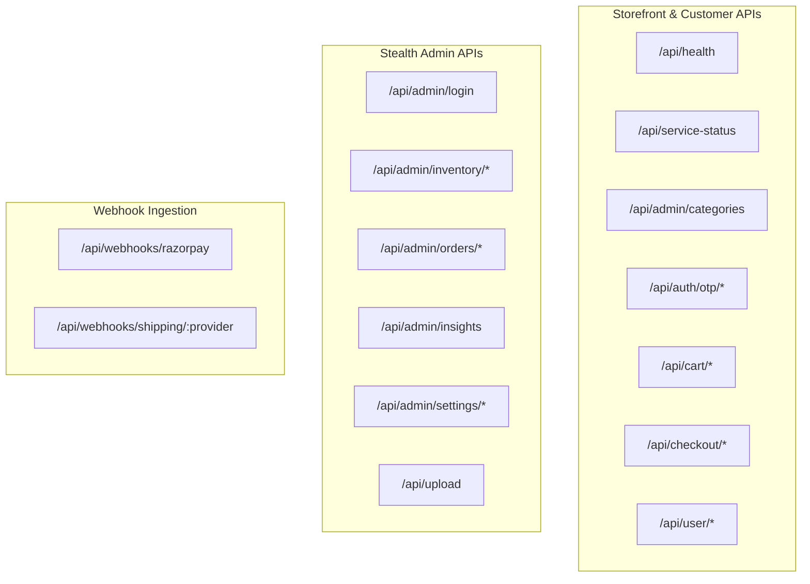

# H&H — Backend API Reference

> Complete technical documentation of all backend REST endpoints, authentication protocols, validation schemas, and webhook contracts for integrating with the H&H platform.

---

## 1. System Overview & Architecture

The H&H backend is organized as a modular Clean Architecture monorepo:

- **Domain Layer (`@hh/domain`)**: Core business rules, Zod schemas, validation pipelines, error primitives, and domain interfaces.
- **Data Access Layer (`@hh/db`)**: PostgreSQL persistence via Drizzle ORM, atomic transactions, row-level locking (`FOR UPDATE`), and audit repositories.
- **Worker Engine (`@hh/worker`)**: BullMQ Redis-backed background worker processing async email, WhatsApp concierge, and carrier webhook synchronization.
- **Web & API Host (`@hh/web`)**: Next.js App Router API endpoints with edge middleware routing, stealth admin security, and Redis sliding-window rate limiting.

### Base URL

- **Development:** `http://localhost:3000`
- **Production:** `https://your-domain.com`

---

## 2. Authentication & Authorization Protocols

### 2.1 Customer Authentication

- **Method:** Passwordless OTP over Phone/SMS/WhatsApp.
- **Session Cookie:** `hh_session` (HTTP-only, Secure in production, SameSite=Lax, signed JWT).
- **Header alternative:** `Authorization: Bearer <JWT_TOKEN>`.

### 2.2 Admin Stealth Gateway

- **Gateway Secret Key:** Queried via `?key=<ADMIN_ACCESS_KEY>`. If absent or incorrect on `/admin` routes, the system responds with a fake **`HTTP 404 (Not Found)`** to conceal the administrative interface from crawlers and public scanners.
- **Master Password Verification:** Verifies constant-time hashed secret in `POST /api/admin/login`.
- **Admin Session Cookie:** `hh_admin_session` (HTTP-only, Secure in production, SameSite=Strict, 12-hour signed HMAC token).

---

## 3. API Endpoints Catalog



---

### 3.1 Observability & Service Health

#### `GET /api/health`

Multi-check liveness and telemetry probe for reverse proxies (Caddy, Kubernetes, Docker healthcheck).

- **Auth Required:** None
- **Response Status Codes:** `200 OK` (Healthy or Degraded), `503 Service Unavailable` (Unhealthy)
- **Response Payload:**

```json
{
  "status": "healthy",
  "timestamp": "2026-09-20T03:45:00.000Z",
  "durationMs": 4,
  "uptimeSeconds": 8420,
  "environment": "production",
  "services": {
    "database": {
      "status": "connected",
      "latencyMs": 2
    },
    "redis": {
      "status": "connected",
      "latencyMs": 1
    }
  },
  "system": {
    "nodeVersion": "v22.13.0",
    "platform": "linux",
    "memory": {
      "rssMb": 98,
      "heapUsedMb": 54,
      "heapTotalMb": 72
    }
  }
}
```

#### `GET /api/service-status`

Public operational status probe informing clients of store maintenance or paused checkouts.

- **Auth Required:** None
- **Response Payload:**

```json
{
  "success": true,
  "serviceControl": {
    "operatingStatus": "operational",
    "checkoutEnabled": true,
    "paymentsEnabled": true,
    "maintenanceNotice": ""
  }
}
```

---

### 3.2 Customer Authentication & Profile

#### `POST /api/auth/otp/request`

Requests a 6-digit OTP code to a mobile number via WhatsApp or SMS.

- **Rate Limit:** 5 requests per 15 minutes per phone/IP.
- **Request Body:**

```json
{
  "phone": "+919876543210",
  "purpose": "login"
}
```

- **Response Payload (`200 OK`):**

```json
{
  "success": true,
  "message": "Verification code sent to your mobile number via WhatsApp/SMS."
}
```

#### `POST /api/auth/otp/verify`

Verifies OTP code and establishes an authenticated session.

- **Rate Limit:** 10 attempts per 15 minutes.
- **Request Body:**

```json
{
  "phone": "+919876543210",
  "code": "123456",
  "name": "Mariam Khan"
}
```

- **Response Payload (`200 OK`):**
  Sets `hh_session` cookie in response headers.

```json
{
  "success": true,
  "user": {
    "id": "usr_94a737f0-2f3b-468c-9bfe-8e2b2da11893",
    "phone": "+919876543210",
    "name": "Mariam Khan",
    "role": "customer"
  }
}
```

#### `GET /api/auth/me`

Fetches the currently authenticated customer profile.

- **Auth Required:** Yes (`hh_session` cookie or Bearer token)
- **Response Payload (`200 OK`):**

```json
{
  "success": true,
  "user": {
    "id": "usr_94a737f0-2f3b-468c-9bfe-8e2b2da11893",
    "phone": "+919876543210",
    "name": "Mariam Khan",
    "email": "mariam@example.com",
    "role": "customer"
  }
}
```

#### `POST /api/auth/logout`

Terminates the active session and clears the session cookie.

- **Response Payload (`200 OK`):** `{ "success": true }`

---

### 3.3 Customer Data & Address Book

#### `GET /api/user/addresses`

Lists all saved shipping addresses for the patron.

- **Auth Required:** Yes
- **Response Payload (`200 OK`):**

```json
{
  "success": true,
  "addresses": [
    {
      "id": "addr_123",
      "recipientName": "Mariam Khan",
      "phone": "+919876543210",
      "line1": "Flat 402, Royal Residency",
      "line2": "Banjara Hills Road No 10",
      "city": "Hyderabad",
      "state": "Telangana",
      "postalCode": "500034",
      "country": "IN",
      "isDefault": true
    }
  ]
}
```

#### `POST /api/user/addresses`

Creates a new shipping address.

- **Request Body:**

```json
{
  "recipientName": "Mariam Khan",
  "phone": "+919876543210",
  "line1": "Flat 402, Royal Residency",
  "line2": "Banjara Hills Road No 10",
  "city": "Hyderabad",
  "state": "Telangana",
  "postalCode": "500034",
  "country": "IN",
  "isDefault": true
}
```

#### `GET /api/user/wishlist` & `POST /api/user/wishlist/[productId]`

Manages patron's saved artisanal pieces with real-time toggle.

#### `GET /api/user/family` & `POST /api/user/family`

Manages family member profiles (names, ring sizes, apparel sizes) for curated gifting.

---

### 3.4 Cart, Coupons & Atomic Checkout

#### `POST /api/cart/validate`

Validates real-time inventory levels, variant pricing, and customization payloads for cart line-items.

- **Request Body:**

```json
{
  "items": [
    {
      "variantId": "var_a1b2c3d4",
      "quantity": 2
    }
  ]
}
```

- **Response Payload (`200 OK`):**

```json
{
  "success": true,
  "summary": {
    "items": [
      {
        "variantId": "var_a1b2c3d4",
        "title": "Royal Emerald Raw Silk Shirt",
        "sku": "MEN-SHIRT-EMR-M",
        "requestedQuantity": 2,
        "effectiveQuantity": 2,
        "priceMinor": 249900,
        "isAvailable": true
      }
    ],
    "subtotalMinor": 499800,
    "isValidForCheckout": true
  }
}
```

#### `POST /api/cart/coupon`

Validates a coupon code against minimum order rules, expiry, and customer usage limits.

- **Request Body:**

```json
{
  "code": "WELCOME10",
  "cartSubtotalMinor": 500000
}
```

- **Response Payload (`200 OK`):**

```json
{
  "success": true,
  "coupon": {
    "code": "WELCOME10",
    "discountType": "percentage",
    "discountValue": 10,
    "discountMinor": 50000
  }
}
```

#### `POST /api/checkout/submit`

Atomically reserves stock for 15 minutes and generates a pending checkout order.

- **Concurrency Protection:** Uses PostgreSQL `SELECT ... FOR UPDATE` row-level locks on stock inventory records within a transactional boundary to prevent overselling.
- **Rate Limit:** 10 requests per minute per IP.
- **Auth Required:** Yes (Patron account required to track order).
- **Request Body (`CheckoutSubmissionSchema`):**

```json
{
  "items": [
    {
      "variantId": "var_a1b2c3d4",
      "quantity": 1,
      "customization": {
        "customText": "H&H Heritage Edition",
        "uploadedArtworkUrl": "/uploads/products/artwork_1789.png"
      }
    }
  ],
  "shippingAddress": {
    "fullName": "Mariam Khan",
    "phone": "+919876543210",
    "email": "mariam@example.com",
    "line1": "Flat 402, Royal Residency",
    "line2": "Banjara Hills",
    "city": "Hyderabad",
    "state": "Telangana",
    "postalCode": "500034",
    "country": "IN"
  },
  "customerNotes": "Please gift pack in signature emerald box",
  "couponCode": "WELCOME10",
  "idempotencyKey": "a986fe74-7650-410a-8452-f199be327110",
  "attribution": {
    "source": "instagram",
    "medium": "bio_link",
    "campaign": "summer_collection_drop",
    "content": "abaya_reel_2",
    "deviceType": "mobile",
    "capturedAt": "2026-09-20T03:00:00.000Z"
  }
}
```

- **Response Payload (`201 Created`):**

```json
{
  "success": true,
  "order": {
    "orderId": "ord_8849b2de-5c68-45ee-97da-c189ecf4a640",
    "orderNumber": "HH-2026-00101",
    "currency": "INR",
    "subtotalMinor": 249900,
    "shippingMinor": 0,
    "discountMinor": 24990,
    "totalMinor": 224910,
    "expiresAt": "2026-09-20T03:45:00.000Z"
  }
}
```

#### `POST /api/checkout/payment-order`

Initializes a payment order on the payment gateway (Razorpay).

- **Request Body:** `{ "orderId": "ord_8849b2de-5c68-45ee-97da-c189ecf4a640" }`
- **Response Payload (`200 OK`):**

```json
{
  "success": true,
  "keyId": "rzp_test_xxxx",
  "orderNumber": "HH-2026-00101",
  "razorpayOrderId": "order_RZP12345678",
  "amountMinor": 224910,
  "currency": "INR"
}
```

#### `POST /api/checkout/verify`

Confirms HMAC-SHA256 signature from client-side gateway response.

- **Request Body:**

```json
{
  "orderId": "ord_8849b2de-5c68-45ee-97da-c189ecf4a640",
  "razorpayOrderId": "order_RZP12345678",
  "razorpayPaymentId": "pay_RZP98765432",
  "razorpaySignature": "2a4e98f09b5...hmac_sha256..."
}
```

- **Response Payload (`200 OK`):**

```json
{
  "success": true,
  "status": "paid",
  "orderNumber": "HH-2026-00101"
}
```

---

### 3.5 Admin Portal Management

#### `POST /api/admin/login`

Authenticates an administrator through the stealth gateway.

- **Rate Limit:** 5 attempts per 15 minutes per IP.
- **Request Body:**

```json
{
  "key": "hh_dev_access_key",
  "password": "hh_dev_master_password"
}
```

- **Response Payload (`200 OK`):**
  Sets `hh_admin_session` cookie in response.

```json
{
  "success": true
}
```

#### `GET /api/admin/categories`

Fetches the full 5-department materialized path category taxonomy.

- **Response Payload (`200 OK`):**

```json
{
  "success": true,
  "categories": [
    {
      "id": "cat_men_tshirts",
      "name": "T-Shirts",
      "slug": "t-shirts",
      "materializedPath": "/men/apparel/t-shirts",
      "department": "men",
      "level": 3
    }
  ]
}
```

#### `POST /api/upload`

Uploads product images or custom print customer artwork using the Strategy Pattern file storage adapter.

- **Security:** Inspects **magic bytes** (JPEG, PNG, WebP, SVG, PDF) to prevent arbitrary executable file uploads.
- **Request:** `multipart/form-data` with field `file` and optional `category: "products" | "artwork" | "brand"`.
- **Response Payload (`200 OK`):**

```json
{
  "success": true,
  "url": "/uploads/products/raw_silk_emerald_front.webp",
  "filename": "raw_silk_emerald_front.webp",
  "sizeBytes": 145020,
  "mimeType": "image/webp"
}
```

#### `POST /api/admin/inventory/create`

Creates and publishes a new piece to the catalog across any vertical with variants and customization rules.

- **Request Body:**

```json
{
  "title": "Heritage Calligraphy Oversized Tee",
  "slug": "heritage-calligraphy-oversized-tee",
  "department": "men",
  "categoryId": "cat_men_tshirts",
  "description": "240 GSM heavy combed cotton tee with bespoke back-print option.",
  "images": ["/uploads/products/calligraphy_front.webp"],
  "specifications": {
    "fabric": "100% Combed Cotton",
    "gsm": "240",
    "fit": "Oversized Boxy",
    "neckline": "Ribbed Crewneck"
  },
  "customizationRule": {
    "allowCustomText": true,
    "maxTextLength": 24,
    "allowImageUpload": true,
    "surchargeMinor": 30000
  },
  "variants": [
    {
      "title": "Black / M",
      "sku": "TEE-CALLI-BLK-M",
      "priceMinor": 149900,
      "initialStock": 50
    }
  ]
}
```

#### `POST /api/admin/inventory/adjust`

Adjusts inventory count with structured audit logs.

- **Request Body:**

```json
{
  "inventoryId": "inv_123",
  "adjustment": 10,
  "reason": "restock",
  "notes": "Received batch #4 from atelier"
}
```

#### `GET /api/admin/insights`

Calculates executive analytics, AOV, repeat retention, product velocity, and marketing channel attribution.

- **Query Params:** `?timeframe=today | week | month | all`
- **Response Payload (`200 OK`):**

```json
{
  "success": true,
  "insights": {
    "timeframe": "week",
    "sales": {
      "revenueMinor": 485000,
      "orderCount": 4,
      "aovMinor": 121250,
      "pendingFulfillmentCount": 2
    },
    "customers": {
      "totalCustomers": 3,
      "repeatCustomers": 1,
      "repeatRatePercentage": 33.3,
      "topCustomers": []
    },
    "productVelocity": [],
    "attribution": {
      "channels": [
        { "source": "instagram", "orderCount": 3, "revenueMinor": 363750, "percentage": 75 },
        { "source": "direct", "orderCount": 1, "revenueMinor": 121250, "percentage": 25 }
      ],
      "topCampaigns": [
        { "campaign": "eid_drop", "source": "instagram", "orderCount": 3, "revenueMinor": 363750 }
      ]
    }
  }
}
```

---

### 3.6 Webhook Receivers

#### `POST /api/webhooks/razorpay`

HMAC-SHA256 authenticated webhook listener for asynchronous payment capture (`payment.captured`, `order.paid`).

- **Header Required:** `x-razorpay-signature`
- **Idempotency:** Webhook event IDs are tracked in the database to prevent duplicate processing.

#### `POST /api/webhooks/shipping/[provider]`

Ingests tracking updates from courier aggregators (DTDC, Delhivery, India Post) and transitions fulfillment state.

- **Providers:** `dtdc`, `delhivery`, `indiapost`

---

## 4. Frontend Fetch Integration Snippet (TypeScript)

```typescript
// Example: Submitting an order from an external Next.js client
import type { CheckoutOrderResult, CheckoutSubmissionInput } from '@hh/domain';

export async function submitCheckoutOrder(
  payload: CheckoutSubmissionInput
): Promise<CheckoutOrderResult> {
  const response = await fetch('https://your-domain.com/api/checkout/submit', {
    method: 'POST',
    headers: {
      'Content-Type': 'application/json'
    },
    credentials: 'include', // Includes hh_session cookie
    body: JSON.stringify(payload)
  });

  const data = await response.json();

  if (!response.ok || !data.success) {
    throw new Error(data.error || 'Failed to reserve and create order');
  }

  return data.order as CheckoutOrderResult;
}
```
